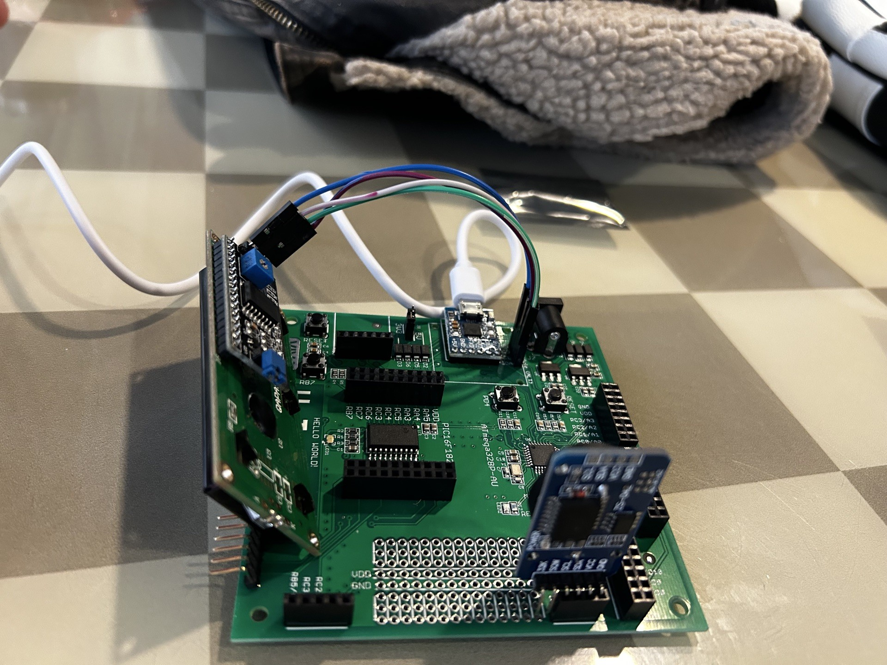
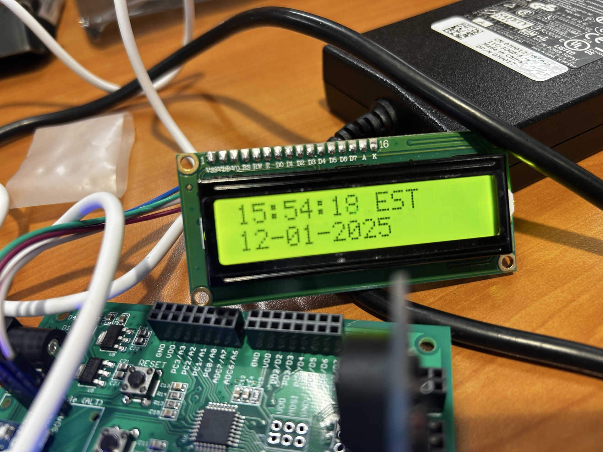
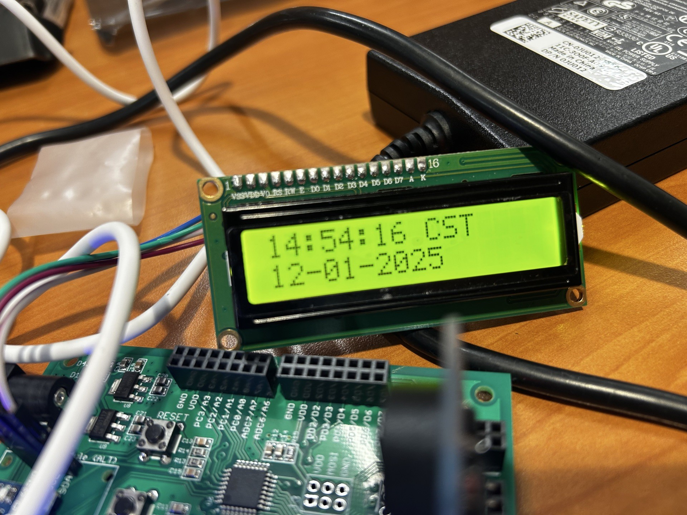
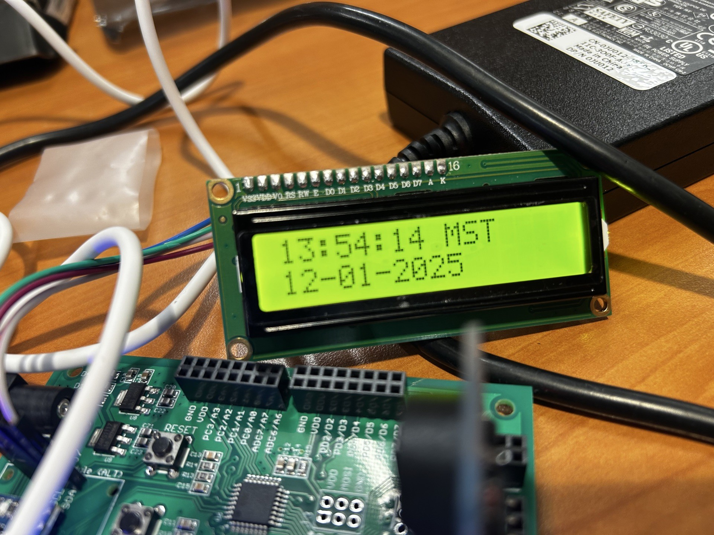
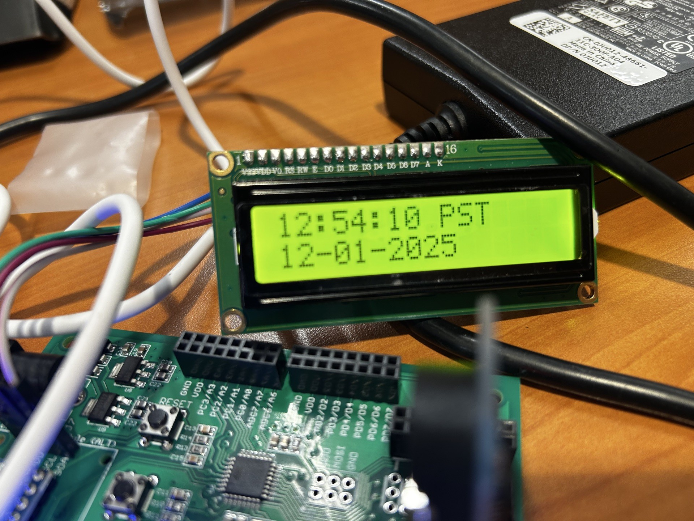

VIVA Final Project – RTC Time Zone Clock

PIC16F1829 | I2C RTC + I2C LCD

## Overview

This project was completed as the final assignment for the VIVA (Microcontrollers I) course at UTSA. It implements a real-time clock system using an external RTC module over I2C and displays the current time and date on a 16×2 I2C LCD.

A pushbutton input allows the user to cycle through major U.S. time zones in real time by applying the appropriate offset to the stored RTC hour value.

## Functionality

The system runs on a PIC16F1829 configured to operate at 4 MHz using the internal oscillator. The microcontroller communicates with a DS3231 or DS1307 real-time clock over I2C to retrieve time and date information.

## Hardware

The project was implemented on the VIVA UTSA board using a PIC16F1829 microcontroller. An external DS3231 or DS1307 RTC module is connected via I2C, along with a 16×2 I2C LCD. A momentary pushbutton connected to RB7 is used for time zone selection.

## Hardware Demonstration

The images below show the final project implemented on the VIVA UTSA board.
They demonstrate system wiring, peripheral integration, and real-time clock
operation across multiple U.S. time zones using an external I2C RTC and I2C LCD.

### System Overview

### Time Zone Demonstration

## Repository Contents

The repository contains the main firmware source for the final project and the headers and sources for the I2C/LCD drivers used in the course.  

## Development Notes

The firmware is based on the skeleton provided in the course. The development is carried out in teams. My contributions are system integration, mechanical design, and design of the enclosures. The firmware is cleaned up for documentation and release. The unnecessary parts of the firmware are removed for better readability. The working functionality of the firmware is retained.  

## Disclaimer

This project was developed for academic purposes as part of coursework and is shared for reference and educational use.
